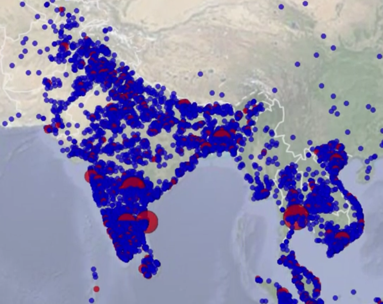

Lesson 1 - What is EDA?
========================================================

### 01 - Data is Ubiquitous

* Use R to conduct EDA
* EDA is one part of a larger process of collecting, learning from and acting on data
* Working with data and visualizations
* By the end of this course we should feel confident when exploring new data sets to uncover new patterns
* How EDA can be used to answer questions from the data
* Data is Ubiquitous - can be found in various places

#### Resources
* [Facebook processes more than 500 terabyte of data a day (2012)](http://news.cnet.com/8301-1023_3-57498531-93/facebook-processes-more-than-500-tb-of-data-daily/)
* One of Facebook's tools, [Presto](http://prestodb.io/) (mainly used for adhoc analysis), processes over 1 petabyte of data per day.
* Learn more about [salmonella](http://www.cdc.gov/salmonella/).
* [Link to Chris's search](http://www.google.com/trends/explore#q=chicken%2C%20music%2C%20movies&cmpt=q) on Google Trends.

### 03 - Go Exploring

#### Resources
* [Google Trends](http://www.google.com/trends/)
* [Google Flu Trends](http://gking.harvard.edu/publications/parable-google-flu%C2%A0traps-big-data-analysis): Limitations of Predicting the Flu with Data

### 04 - Why learn EDA

* EDA is finding relationships between variables through both numerical and graphical analysis
* It happens before more formal, more rigorous statistical analysis of data
* Often first part of larger process - can lead to insights, new questions or even feed into process of building predictive models
* Defense against bad data, checking assumptions and intuitions about data set

##### Example of EDA

* During netflix prize competition [data visualization](http://abeautifulwww.com/2007/04/03/an-interactive-visualization-of-the-netflix-prize-dataset/) was created for movies which show clusters of movies receiving similar rating
* Movies that are closer together get similar rating

* Such visualizations help us get a feel for the data. Helps us determine what should be explored further
* Even before performing we can learn a lot about our data through visualizations
* EDA helps you
    + learn in-demand skills 
    + let you compete in competitions that have prizes even upto a million dollars
    + helps you reason about data
    + sharpen your communication skills
    + expand your career opportunities

#### Resources
* [What is the Netflix Prize? ](http://en.wikipedia.org/wiki/Netflix_Prize)
* [Netflix Prize Dataset Visualization](http://flowingdata.com/2007/12/11/netflix-prize-dataset-visualization/)
* Todd Holloway's [Interactive Visualization](http://abeautifulwww.com/2007/04/03/an-interactive-visualization-of-the-netflix-prize-dataset/)

### 05 - Aude's Interest in Data

Let's see what Aude (Facebook data scientist) likes most about being a data scientist.

* Being able to go from having Billions and trillions of rows of data and reach a point where we have some idea about what might be intersting about the data
* Then investigate the same in different ways
* Stumble across something which is interesting and then we want to dig deeper
* Using that to use data in an algorithm
* Goal is 
    + to have an impact
    + Understand the world 
    + improve Facebook product
    + go from 
        + we have all this data and we don't know what to use it for to
        + having an impact using the data

#### Resources
* [Aude Hofleitner](http://www.linkedin.com/in/audehofleitner)
* [Getting Into Data.pdf](https://storage.googleapis.com/supplemental_media/udacityu/903038546/Getting%20Into%20Data.pdf)

### 06 - Goals of EDA

* Goals of EDA is understanding data through visualizations and statistical tools
* Initial interaction with data
* Looking at tables of data does not give us any understanding about the nature of data. Would be difficult
* We want to understand the distribution of variables
    + We may create histograms which shows distribution
    + We may create scatterplots which help us understand coorelation
* We want to assess and validate our assumptions on which future inferences will be based
* We want to understand data before forming intelligent hypothesis
* Ultimately we are developing intuition about the data set and how it came into existence
* Which variables have most predictive power

#### Resources
* [Exporatory Data Anaylsis](http://en.wikipedia.org/wiki/Exploratory_data_analysis)
* some more assumptions we might consider
    + we should expect that mpg is in a certain range, so we could validate that assumption
    + we might wonder how precisely hp is measured or reported here (is it an integer always?)

### 08 - The Growth of Televisions

Nathan did a timeseries analysis. Considered year-on-year changes in Televsion sizes

* We should always be skeptical about what story the data may tell
* We should ask questions about the data, inspect it and consider its context

#### Resources
* Nathan Yau's Flowing Data: [The Growth of Televisions](Nathan Yau's Flowing Data: The Growth of Televisions)

### 09 - Our Approach for This Course

* Always be curious and skeptical when taking at look at the data
* Nate Silver said

> On average people should be more skeptical when they see numbers. They should be more willing to play around with the data themselves.

* EDA is one of the best tools to play around with the data
* You should be excited to play with the data but also be open to detecting oddities in the data especially through visualizations and summaries 

#### Resources
* One example to consider from the Facebook data set is that total likes by a Facebook user should be greater or equal to mobile likes by that user

### 10 - Aude Explores Coordinated Migration

* Gathered Home town and current cities for all the users
* Looking at probabilities - given home town what are chances of living in a certain city
* Was expecitng that the most likely place where you currently live would be your home town
* But found that in a fair number of cases the most likely city was different from the home town
* Decided to put all these pairs of cities where the most likely current city was different than the home down on a map

* The results were fascinating as that was not what they were expecting. They were seeing patterns arise 
* Lot of small cities moving to the current city
* Decided to use d3 for adding interactivity in the graphs

#### Resources
* [Interactive Visual Explanation of Conditional Probabilities](http://setosa.io/conditional/)
* [Coordinated Migration](https://www.facebook.com/notes/facebook-data-science/coordinated-migration/10151930946453859)
* [Global Urbanization Trends](http://esa.un.org/unup/)
* You can make interactive visualizations using the JavaScript library [d3.js (Data Drive Documents)](http://d3js.org/). We will not use d3.js in this course, but it can be a useful tool for creating interactive plots and dashboards, especially after some initial EDA.

### 11 - Course Overview

* Will start with analyzing one variable at a time.  This helps us see
    + underlying distributions
    + what types of values the variables take on
* Eventually visualizations will become more complex as we look at 
    + pairs of variables 
    + multiple variables 

#### Resources
* [The R Programming Language](http://en.wikipedia.org/wiki/R_(programming_language))
